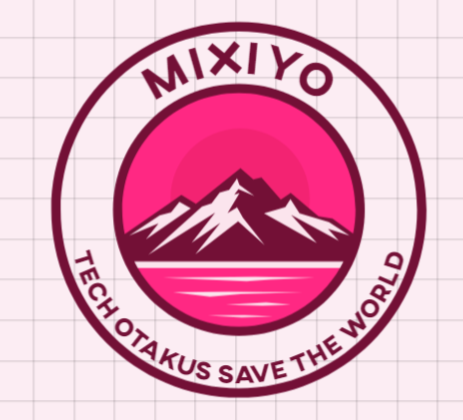
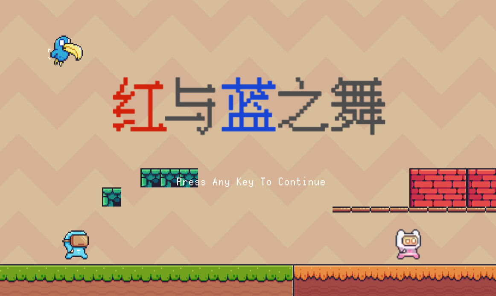
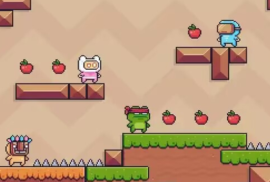
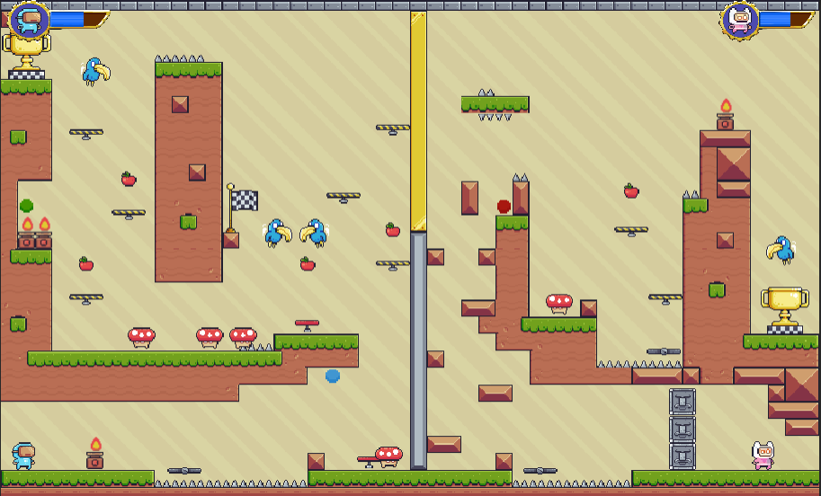
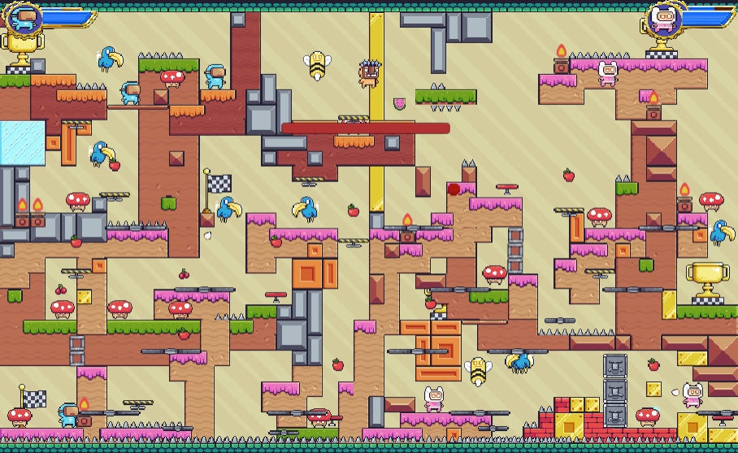
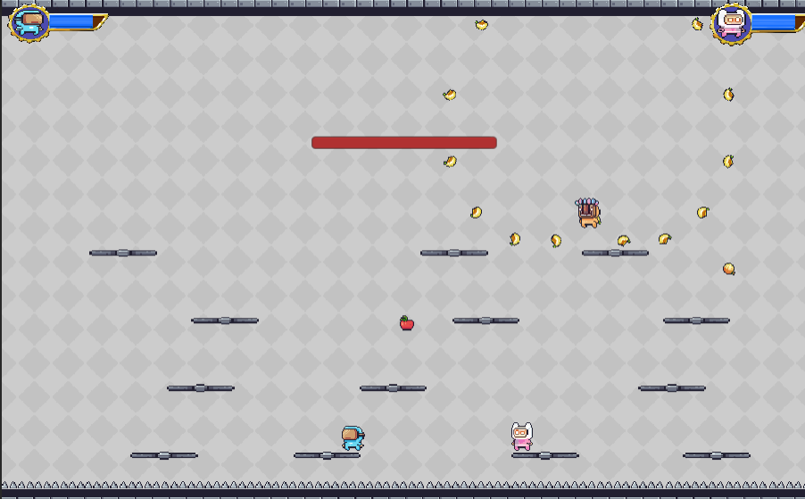

# 红与蓝之舞 :wink::wink::wink:  A Dance of Red and Blue

西安交通大学 2024 春 unity游戏开发 **米嘻游** :panda_face:   作品

WebGL [部署地址](https://6902140.github.io/redblue.github.io/) <-点击即可在线体验

---------------------
### PART1 游戏背景介绍
- 故事开始于小蓝和小红的家园，一个平和而宁静的小村庄。小红和小蓝原本幸福恩爱的生活在一起，然而某一天，一只邪恶的牛头人突然降临在这个世界上，将村庄变得一片混乱和恐慌，小红小蓝也迫不得已分开。

---------------------
- 神奇的是，二人发现，他们对彼此的环境存在着影响，他们之间的联系不仅仅是精神上激励和支持，而且超越了现实的界限。他们的存在和行动可以影响周围的环境，而环境中的力量也能为他们提供帮助和支持。

快来借助你的力量让他们重逢吧！

-----------------------

### PART2 游戏玩法介绍

本游戏中存在大量的水果道具和双人协作技巧：

**stage 1：**

说明：

我方道具：

🍎：给Player 回复血量

绿色小球：交换Player1和Player2的位置

蓝色小球：给另一边玩家开锁

敌方角色

🍄：会在水平地面上左右行走巡逻的小怪，可以通过从上方踩下消灭它。

🐦：会在空中左右巡逻的小怪，可以通过从上方踩下消灭它。

火炬：如果贸然碰到会损失血量，不过仅生效一次。

地刺：如果贸然碰到会损失血量，一直生效。

获胜条件：

红蓝玩家均触碰到自方的🏆

按下O键可以直接跳过关卡哦

**stage2:**

新增道具：

🍉：增强版苹果，拾取到会直接将血条回满

🍒：拾取到会给队友回复血量

新增敌方角色：

🐝：会在地图最高高度左右移动并进行射击

获胜条件：

红蓝玩家均触碰到自方的🏆

**final stage：**

终于进入到最终的关卡了

在这一关中，boss酋长会进行智能的技能释放和移动

boss技能说明：

- skill1 🍌弹幕：酋长会站在高空中，对四周进行密集的香蕉弹幕攻击
- skill2 🐝召唤：酋长会在地图最高层召唤蜜蜂对player进行垂直方向的攻击
- skill3 🦇召唤：酋长会召唤🦇仆人随机跟踪player进行吸血
- skill4 横冲直撞：酋长自身会瞄准player进行高速移动对玩家进行多轮撞击

玩家操作说明：

- 玩家通过拾取🍎进行血量回复
- 玩家通过拾取🍊对酋长进行攻击

获胜条件：

将酋长血量清空

---------------------

### part3 鸣谢：

- 指导老师： [Mr.Kelvin Sung, Professor](https://www.uwb.edu/stem/faculty/css-faculty/ksung)

- 素材来源：https://otologic.jp/

- 创意来源：[森林冰火人](https://www.i-gamer.net/site/3086.html) , [冰与火之舞](https://store.steampowered.com/app/977950/_A_Dance_of_Fire_and_Ice/?l=schinese)